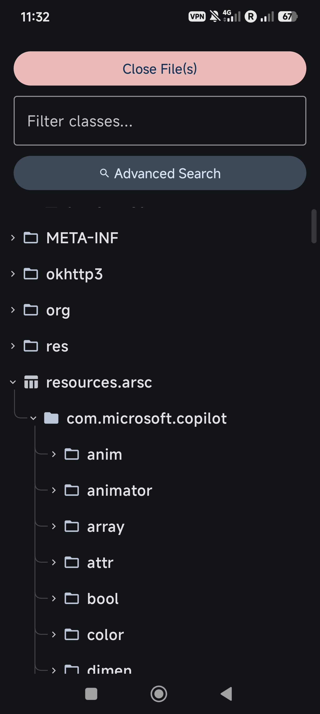
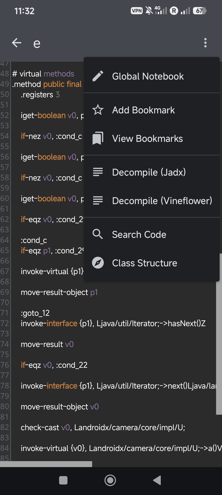
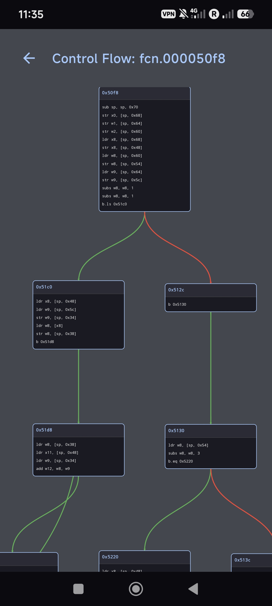
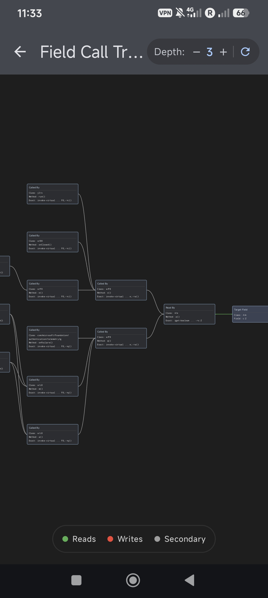
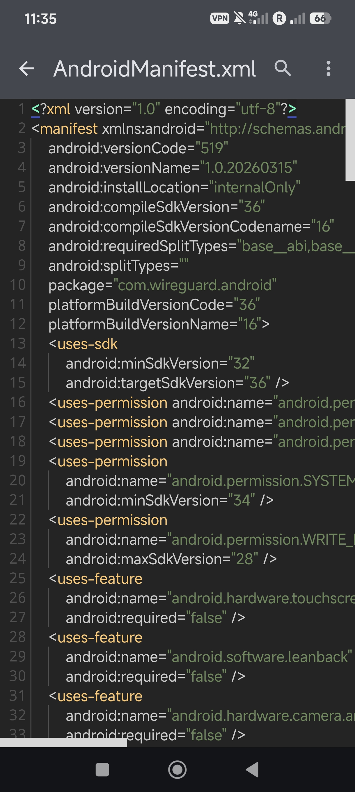
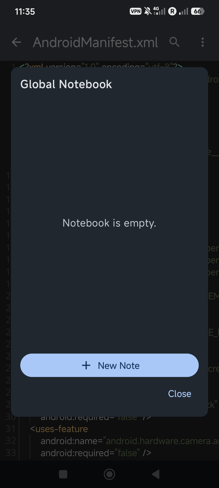

# Android Reverse 🛠️📱

   
  
    

**Android Reverse** is a professional-grade, fully mobile-centric decompiler and reverse engineering suite. Engineered to run entirely on your Android device, it delivers a desktop-class analysis experience, blending high-performance native binary inspection with a sleek, deep dark interface and neon accents. 

Whether you are navigating obfuscated Smali bytecode, mapping native C/C++ control flows, or extracting hardened APK resources, Android Reverse provides a complete, unified toolkit on the go.

---

## ⚡ Core Capabilities

### 🔬 Advanced Native Binary Analysis
Powered by an embedded Radare2 engine, the app provides deep insights into native shared libraries (`.so`).
* **Interactive Control Flow Graphs (CFG):** Visually navigate assembly blocks with a draggable, pinch-to-zoom node canvas.
* **Call Graph & Xref Tracing:** Instantly generate depth-adjustable graphs mapping incoming/outgoing calls and field reads/writes.
* **Block Inspector:** Deep-dive into raw assembly instructions, memory addresses, and execution heuristics.
* **Multi-Mode Decompilation:** Switch seamlessly between C pseudo-code, Hex dumps, and raw Assembly.

### 📝 Intelligent Code Inspection & Navigation
Built around the high-performance Sora Editor with TextMate syntax highlighting (Darcula theme). 

> **⚠️ Note on Code Editing:** *Android Reverse is currently focused on advanced code analysis and inspection. Live code editing and APK recompilation are not yet available in the current release.*

* **Multi-Engine Java Decompilation:** Choose between Jadx and Vineflower to decompile Dalvik bytecode back to Java on the fly.
* **Smart Smali Navigation:** Jump directly to class and method definitions from Smali registers with built-in symbol resolution.
* **Class Structure Compass:** Instantly filter and jump to methods or fields within massive classes.

### 🛡️ Resilient Resource & Package Decoding
* **Universal App Extraction:** Extract, merge, and parse `.apk`, `.xapk`, and split `.apks` directly from local storage or installed system apps.
* **Hardened AXML Decoding:** Custom `AXMLPrinter` implementation utilizing reflection to bypass modern `resources.arsc` obfuscation and anti-decompilation tricks.
* **Deep ARSC Parsing:** Navigate complex resource tables, string pools, and XML attribute mappings through a unified tree view.

### 🛠️ Pro-Workflow Tools
* **Deep Memory Search:** Lightning-fast, regex-supported hexadecimal and string searching across Smali, class names, and native binary patterns.
* **Global Notebook:** A persistent, built-in notebook system to document reverse-engineering progress, track offsets, and save snippets across sessions.
* **Class Bookmarking:** Pin critical classes for rapid access during complex analysis sessions.

---

## 📸 Interface Showcase

| Dashboard & Extraction | Smali Navigation & Inspection | Native Control Flow (CFG) |
|:---:|:---:|:---:|
|    *Tree-view extraction & package parsing* |    *Sora Editor with Jump-to-Definition* |    *Interactive Radare2 assembly blocks* |

| Call Graph Tracing | Resilient AXML Decoding | Global Notebook |
|:---:|:---:|:---:|
|    *Depth-adjustable cross-reference mapping* |    *TextMate-highlighted XML viewing* |    *Persistent multi-session note tracking* |

*(Screenshots coming soon)*

---

## ⚠️ Disclaimer
This tool is developed strictly for educational purposes, security research, and analyzing applications where you have explicit permission from the author. The developer assumes no liability for misuse.

---

   

  
    <b>Special Thanks:</b> 
    This project leverages the incredible <a href="https://github.com/Rosemoe/sora-editor">Sora Editor</a> for high-performance mobile code inspection. 
    Native binary decompilation, heuristic analysis, and graphing capabilities powered by the <a href="https://github.com/radareorg/radare2">radare2</a> framework.
  

